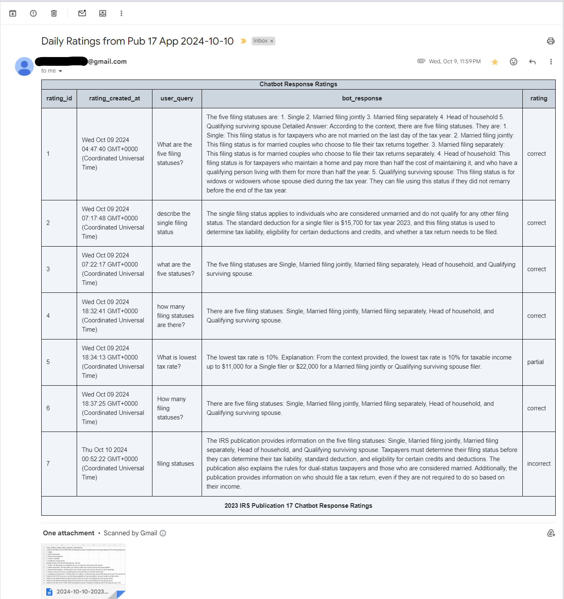

# Tax RAG App - Database and Mailer Service

[Front-End Site](https://taxragapp.vercel.app/)
[Front-End Site GitHub](https://github.com/randr000/tax_llm_next_app)

### This service is comprised of two components:
### 1. A MySQL database that stores the user ratings of bot responses
### 2. An email service that sends an email with a table of all user ratings for a specific day

Install project dependencies

```bash
npm install
```
copy sample.env and insert environment variables
```bash
cp sample.env .env
```
```
PORT=<Port the service will run on>
MYSQL_DATABASE=<insert your own database name>
MYSQL_USER=<insert your own MySql username>
MYSQL_PASSWORD=<insert your own MySql password for your MySql username>
MY_SQL_HOST=<localhost or your own custom host>
MY_SQL_PORT=<insert port number MySql service will run on, default is 3306>
GMAIL_APP_USER=<Gmail account where you will send emails from>
GMAIL_APP_PASSWORD=<Create Gmail app password in account your will be sending emails from https://help.prowly.com/how-to-create-use-gmail-app-passwords>
GMAIL_APP_EMAIL_TO=<Gmail account where you will send emails to>
```
Download the official MySQL Docker image. Instructions are located [here](https://hub.docker.com/_/mysql).

Here is a sample configuration for a Docker compose YAML file:
```yml
  mysql-rating-db:
    image: mysql:latest
    restart: always
    container_name: mysql-rating-db
    ports:
     - 3306:3306
    expose:
      - 3306
    volumes:
      - ./mysql_rating_db/mysql_volume:/var/lib/mysql
      - ./mysql_rating_db/init:/docker-entrypoint-initdb.d
    env_file:
      - mysql-rating-db.env
```
The initialization scripts will run in alphanumeric order. Save them in the init folder that will be mounted to docker-entrypoint-initdb.d in the MySQL docker container.
<br>
Filename: 0.sh
```bash
mysql -uroot -p${MYSQL_ROOT_PASSWORD} -e "CREATE DATABASE IF NOT EXISTS ${MYSQL_DATABASE};"
mysql -uroot -p${MYSQL_ROOT_PASSWORD} -e "USE ${MYSQL_DATABASE};"
```
Filename: 1.sql
```sql
CREATE TABLE IF NOT EXISTS query_ratings(
    rating_id INT AUTO_INCREMENT PRIMARY KEY,
    rating_created_at TIMESTAMP DEFAULT CURRENT_TIMESTAMP,
    user_query VARCHAR(300) NOT NULL,
    bot_response VARCHAR(5000) NOT NULL,
    rating VARCHAR(9)
);
```
Filename: 2.sh
```bash
mysql -uroot -p${MYSQL_ROOT_PASSWORD} -e "CREATE USER ${MYSQL_USER}@localhost IDENTIFIED BY '${MYSQL_PASSWORD}';"
mysql -uroot -p${MYSQL_ROOT_PASSWORD} -e "GRANT SELECT, INSERT, DELETE, UPDATE ON query_ratings TO '${MYSQL_USER}'@'localhost';"
mysql -uroot -p${MYSQL_ROOT_PASSWORD} -e "FLUSH PRIVILEGES;"
```
To start the backend service that stores the ratings in the MySQL database
```bash
node server.js
```
To create the cron job that schdules the email that will be sent once a day. Previous ratings are automatically deleted from the database when the email is sent.
```bash
node cronJobMail.js
```
Sample email:

It is recommended to run this service within a Docker container. The Dockerfile located in the project's root directly can be used to create the image.